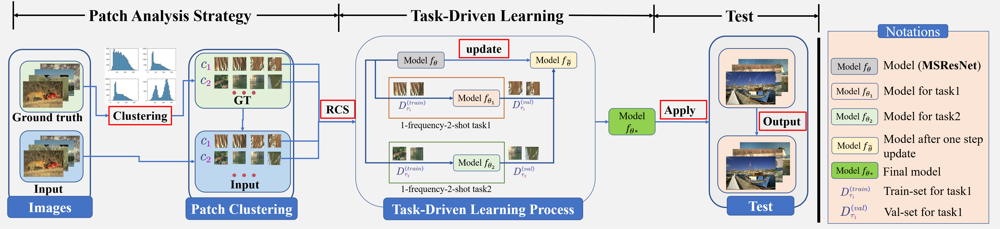
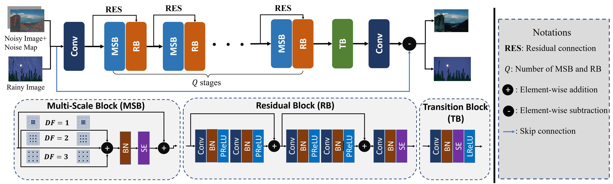

# TRNR (making up ... , not the final edition)
#### The pytorch implementation of "Task-driven Image Deraining and Denoising with a Few Images Based on Patch Analysis"

* An overview of the task-driven learning approach.



* Model architecture for image deraining and denoising. 



## Requirements

```python
#Requirements
######### Python Libraries #########
1. Pytorch (>=1.9.0)
2. tqdm
3. opencv-python (cv2)
4. PIL
######### CUDA Environment #########
CUDA version >= 11.3
```

## Inference

Please refer to the testing files:

- `test_rain.py `: utilized to test model on **Synthetic deraining**  datasets.
- `test_noise.py`: utilized to test model on **denoising** datasets.
- `test_real.py`: utilized to test model on **Real-world deraining** datasets.

Codes below show examples of testing function call.

```python
python test_rain.py --test_model ${test model path}$
python test_noise.py --test_model ${test model path}$
python test_real.py --test_model ${test model path}$
```

For a successful testing, you may need to modify the **testing dataset key arguments**, the **configuration for test-set**, and the **checkpoint path**. 

The **Pre-training checkpoints** will be uploaded soon.

- testing dataset key arguments (Take Rain100L in `test_rain.py` for an example)

  ```python
  Rain100L_test_kwargs = {
      'dataset': 'Rain100L-t', # dataset name as a key for configuration 
      'type': 'rain', 
      'clean_dir': '/home/rw/Public/datasets/derain/Rain100L/norain', # ground truth folder
      'noise_dir': '/home/rw/Public/datasets/derain/Rain100L/rain', # rainy image folder
  }
  ```

- configuration for test-set (A dictionary to set the test clean/rainy image format | `test_rain.py` as an example)

  This test format refers to [ReHEN](https://github.com/nnUyi/ReHEN) (*thanks for sharing*)

  ```python
  dataset_config = {
  'Rain100L-t': ('norain-{:03d}.png', 'rain-{:03d}.png', 100, 1),
  'Rain100H-t': ('norain-{:03d}.png', 'rain-{:03d}.png', 100, 1),
  'Rain800-t': ('norain-{:03d}.png', 'rain-{:03d}.png', 100, 1),
  # (dataset_name: (clean_format, rain_format, tot_number, beginning index))
  }
  ```

- checkpoint path (path of pretrained model)

  ```python
  # checkpoints path 
  'Rain100L-S': 'results/derain/MSResNet-Rain100L-100-TRNR/best.pth'
  'Rain100H-S': 'results/derain/MSResNet-Rain100H-250-TRNR/best.pth'
  'RainLight-S': 'results/derain/MSResNet-Rain200L-100x6-TRNR/best.pth'
  'RainHeavy-S': 'results/derain/MSResNet-Rain200L-100x6-TRNR/best.pth'
  'Rain1400-S': 'results/derain/MSResNet-Rain1400-100x14-TRNR/best.pth'
  'WaterlooBSD-S (Color)': 'results/denoise/MSResNet-WaterlooBSD-500-Color-TRNR/best.pth'
  'WaterlooBSD-S (GRAY)': 'results/denoise/MSResNet-WaterlooBSD-500-Color-TRNR/best.pth'
  ```

## Training models with TRNR

You can train model using the script below

```python
python train_metalip.py --root_dir ${data_dir} --freqn 12 --task_num 5 --meta_lr 0.001 --update_lr 0.001 --number_of_training_steps_per_iter 2 --batch_size 5 --ssim_weight 5.0 --total_iteration 60000 --channel_weight 0.0 
```

The `Arguments` are defined in the file `utils/arguments.py`, some key arguments are:

- number_of_training_steps_per_iter: number of training steps in the inner-loop (default 2)
-  update_lr: learning rate for inner-loop (default: 1e-3)
- meta_lr: learning rate for outer-loop, task-driven learning (default: 1e-3)
- task_num: number of N-frequency-K-shot tasks in the training stage (default: 5)
- freqn: number of image patch pair in each N-frequency-K-shot task (default: 16)
- total_iteration: number of total iterations
- root_dir: the default clustered dataset path
- ssim_weight: hyper-param that leverages the ssim loss weight

The clustered images are organized as below:

```bash
|-root_dir
         |-train
                |-rain # rainy patches
                      |-cp-0 # first cluster
                           |-patch-0.png
                           |-patch-1.png
                           ...
                      |-cp-1 # second cluster
                      ...
                |-clean # clean patches
                      |-cp-0
                           |-patch-0.png
                           |-patch-1.png
                           ...
                      |-cp-1
                      ...
         |-test
                |-rain # rainy patches
                |-clean # clean patches
```

**Please download datasets for the re-implementation of TRNR through links below:**

[Baidu Cloud](https://pan.baidu.com/s/1Izk3e8XThCE0wGJ_neCt3A?pwd=otjs)

[Google drive](https://drive.google.com/drive/folders/14qWdyxcbw7FMpWGWBQL5ubzgOIbGR7IP?usp=sharing)

The specular argument settings for different datasets are listed below:

- Rain100L-S: `batch_size/task_num: 5, freqn: 12, total_iteration: 60000`
- Rain800-S: `batch_size/task_num: 3, freqn: 32, total_iteration: 120000`
- Rain100H-S: `batch_size/task_num: 5, freqn: 12, total_iteration: 60000`
- RainLight-S / RainHeavy-S: `batch_size/task_num: 3, freqn: 32, total_iteration: 120000`
- Rain1400-S: `batch_size/task_num: 3, freqn: 32, total_iteration: 280000`
- WaterlooBSD-S: `batch_size/task_num: 3, freqn: 18, total_iteration: 500000`

## Prepare your own datasets

## Customize your own model

## Ablation Instruction

## Results


